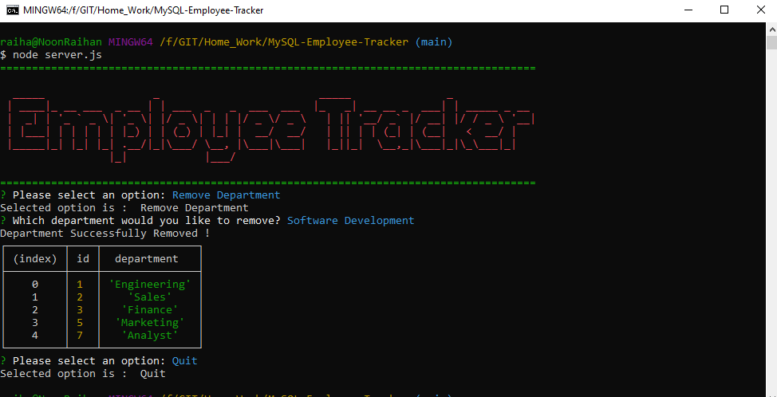

# MySQL-Employee-Tracker

Git Hub repo URL : https://github.com/RaihanAkter03/MySQL-Employee-Tracker


## Description
This is a command line application where user will be able to 

  * Add departments, roles, employees
  * View departments, roles, employees
  * Update employee roles
  * Update employee managers
  * View employees by manager
  * Delete departments, roles, and employees

 * Used the [MySQL](https://www.npmjs.com/package/mysql) NPM package to connect to your MySQL database and perform queries.

* Used [InquirerJs](https://www.npmjs.com/package/inquirer/v/0.2.3) NPM package to interact with the user via the command-line. 

* db folder have schema and seeds sql file for executing queries.


## User Story

```
As a business owner
I want to be able to view and manage the departments, roles, and employees in my company
So that I can organize and plan my business
```
## Instruction

* We have to install the dependencies are been used on this application.
* install npm mysql
* install npm inquirer
* install npm chalk & figlet
* We have two sql file name schema & seeds file.
* we have server.js file for runing application.
* once we start the command line on node.js server.js
* command line will ask different question to user and hold the answer and execute the query to response.

##




